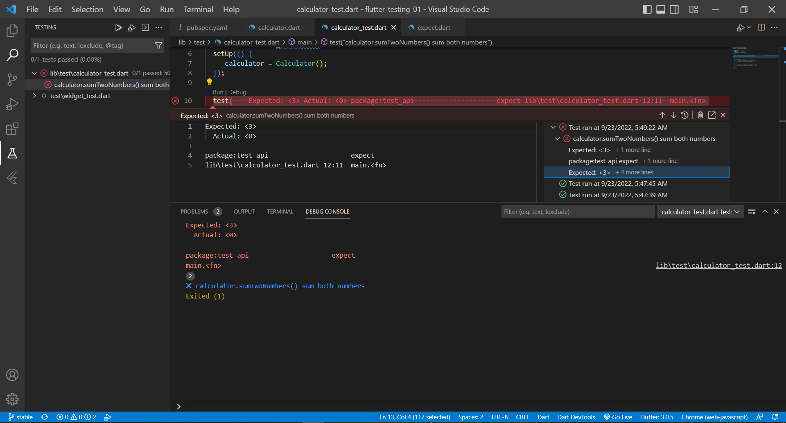
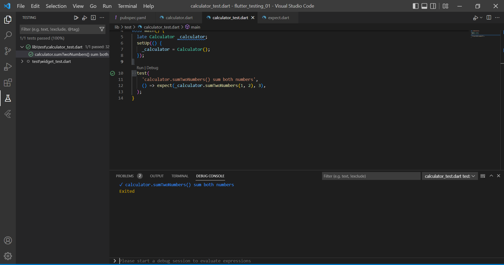
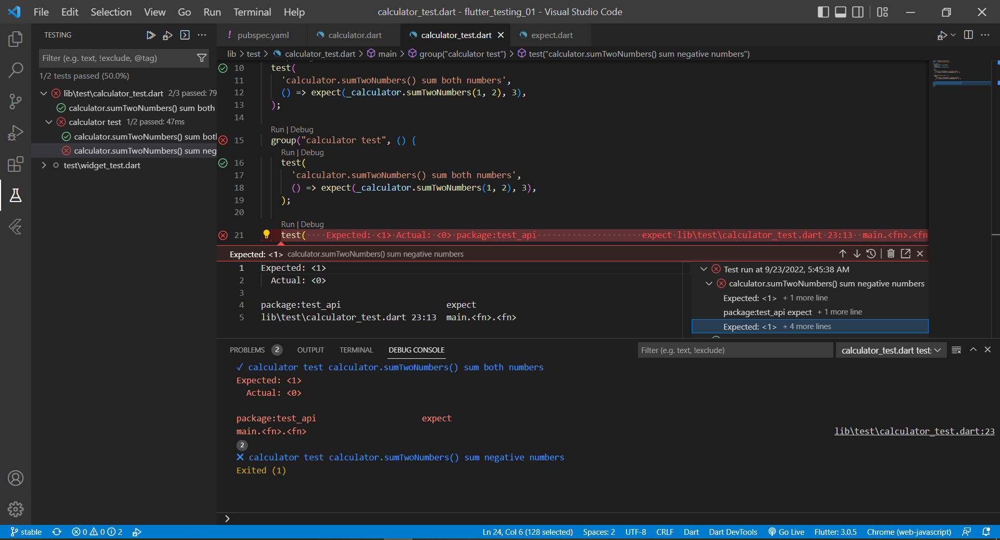
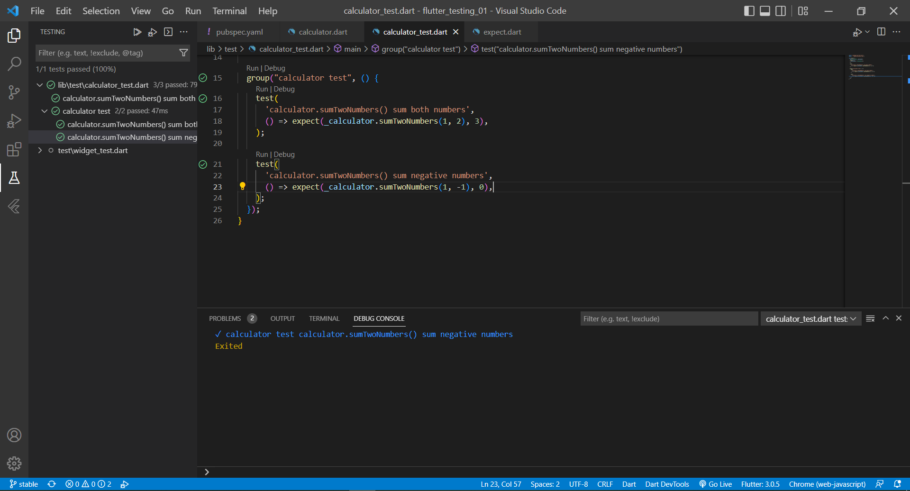
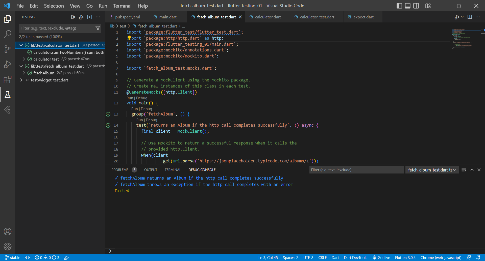

# flutter_testing_01

Pertemuan 35 Unit Testing Bagian 1.

## Calculator Testing

Hasil output pertama pada calculator_test adalah gagal karena ekspektasi dan aktual dari code tidak sesuai berikut adalah hasilnya.

Berikut adalah cara memperbaiki code yakni menyesuaikan ekspektasi dan aktual dengan mengganti kode pada file calculator.dart di fungsi Calculator menjadi return a + b. Berikut adalah hasil testing setelah diperbaiki.

## Melakukan Grouping

Pada langkah pertama testing masih gagal di salah satu statement karena ketidaksesuaian code yakni pada line 22 dimana 1 + (-1) diharapkan hasilnya 1. Berikut adalah hasil testing.

Berikut adalah hasil setelah perbaikan code.

## Mocking menggunakan Mockito

Melakukan unit testing pada sebuah fungsi yang digunakan untuk mengambil data dari web service API. Berikut adalah hasil testing.

